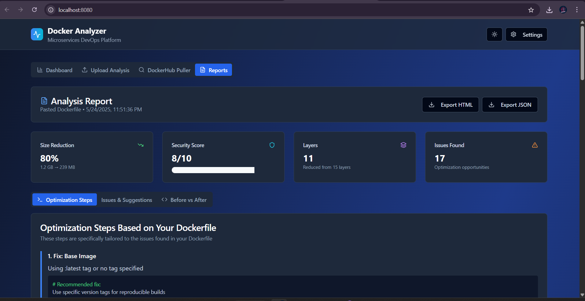

<h1 align="center"> Docker Insight Optimizer</h1>

<p align="center">
  
  
  
  
  
  
  
  
</p>

<p align="center">
  
</p>


---

> A sleek and responsive Docker layer visualizer built with **React + Vite**. It lets you **upload Dockerfiles**, inspect **layered image insights**, and analyze the **optimization potential** of your Docker images. Great for learning and debugging container builds.

---

## 🧑‍💻 DevOps Skills Demonstrated

- 🐳 Docker & Multi-stage Build
- 📦 Containerization Best Practices
- ⚛️ Vite + React for UI
- 📁 Layer Insight Parsing
- 🛠️ Nginx as Web Server for Static Hosting
- 🧪 Clean, Modular Frontend Architecture
- 🚀 Deployment-Ready Build with Docker & Docker Compose

---




---

## ⚙️ Tech Stack

| Tech            | Description                       |
|----------------|-----------------------------------|
| React           | Frontend framework                |
| Vite            | Lightning-fast dev & build tool   |
| Docker          | Containerization                  |
| Nginx           | Production web server             |
| HTML/CSS/JS     | UI Structure & Design             |

---

## 🛠️ How to Run This Application

### 📌 Prerequisites

- Node.js (v18+)
- Docker
- (Optional) Docker Compose

---

### 🧪 Run Locally with Node

```bash
# Clone the repo
git clone https://github.com/Coding4Deep/docker-insight-optimizer.git
cd docker-insight-optimizer

# Install dependencies
npm install

# Start development server
npm run dev

# Open http://localhost:5173
```

---

### 🐳 Run with Docker

#### 1. **Build the Docker Image**

```bash
docker build -t docker-insight-optimizer .
```

#### 2. **Run the Container**

```bash
docker run -d -p 8080:80 docker-insight-optimizer
```

📍 Now visit [http://localhost:8080](http://localhost:8080)

---

### 📦 Run with Docker Compose

```bash
docker-compose up --build
```

---

## 🌟 Features

- 📤 Upload any Dockerfile
- 🔍 Parse and visualize each Docker layer
- 📊 Insightful layer stats and optimization suggestions
- 🧼 Clean and elegant UI with animations
- ⚡ Super-fast thanks to Vite + React

---


## 📄 License

This project is licensed under the **MIT License** - see the [LICENSE](./LICENSE) file for details.

---

> 💡 _"Built to analyze Docker layers visually and learn containerization deeply."_  
```
